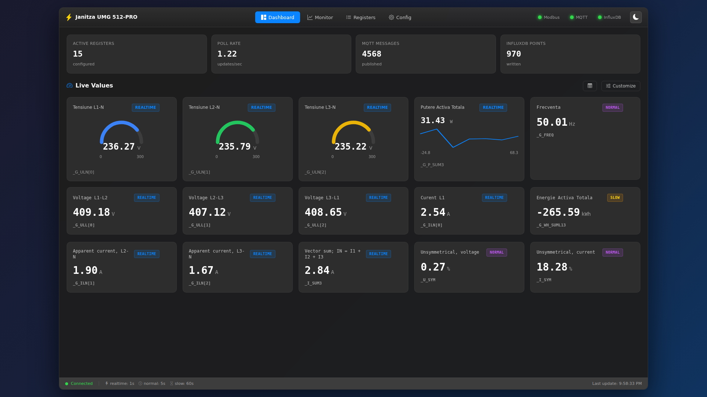
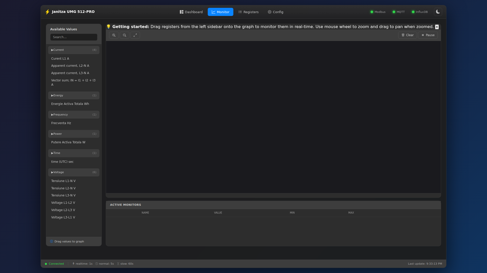
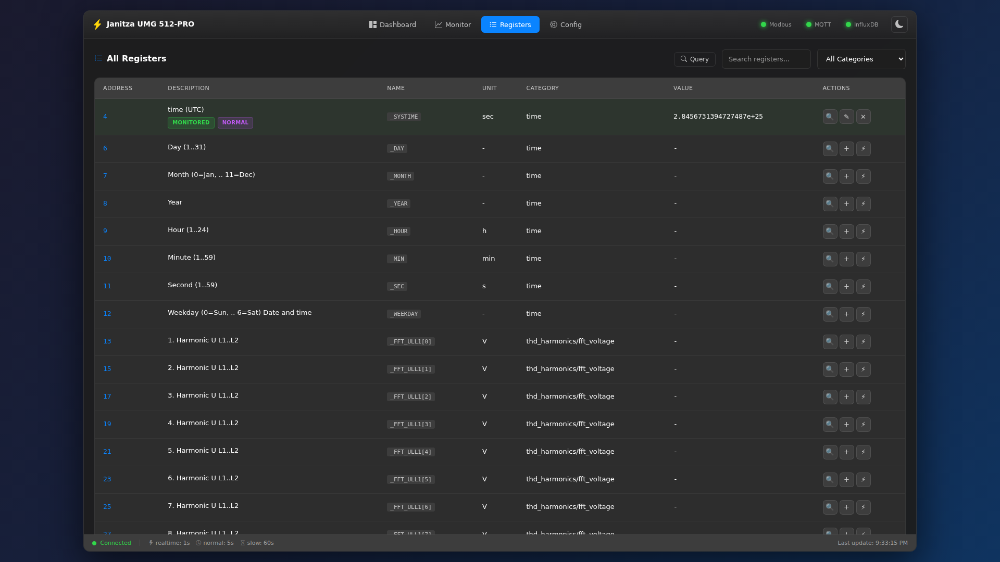
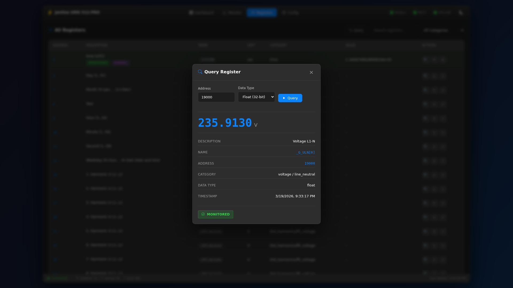
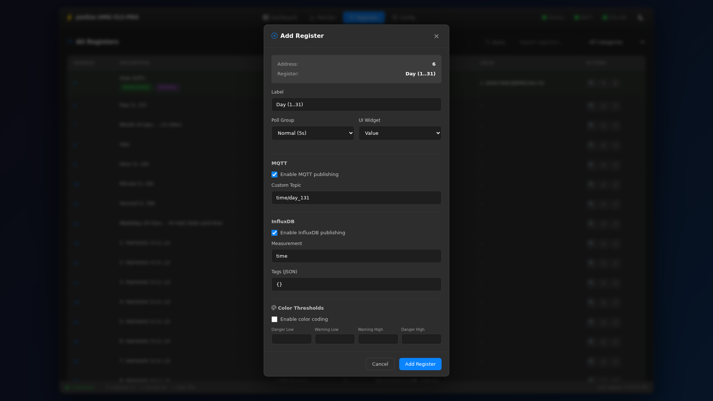
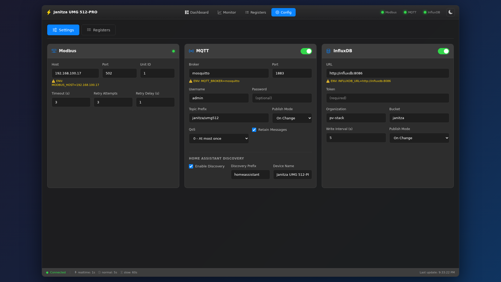
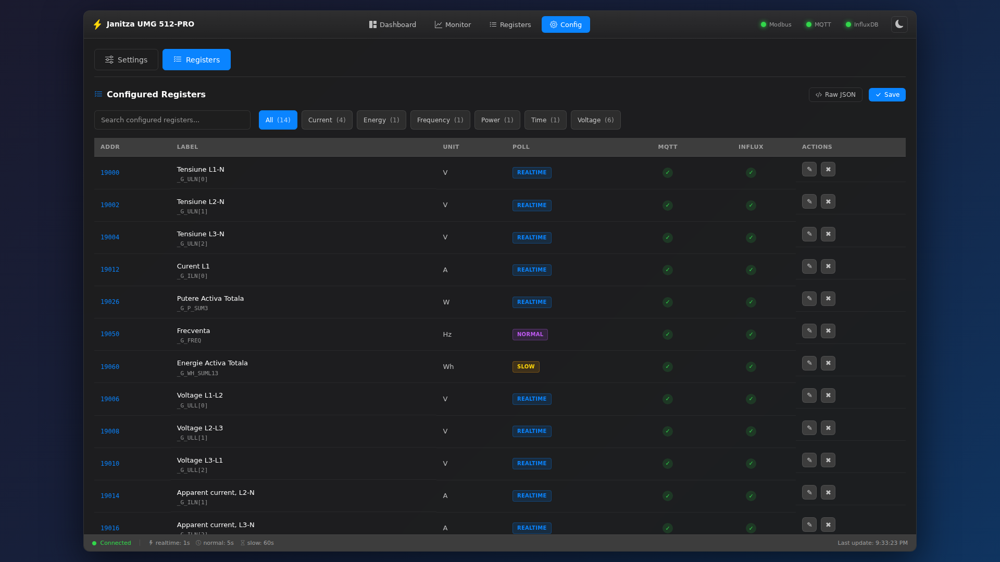
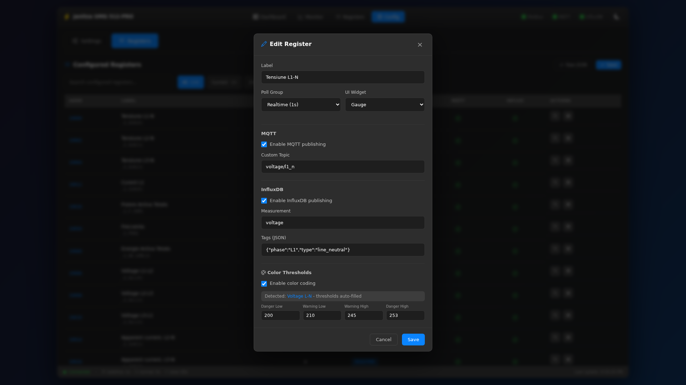

# Janitza UMG 512-PRO Monitor

[🇷🇴 Română](README.md) | 🇬🇧 **English**

Professional monitor for Janitza UMG 512-PRO power quality analyzers. Reads data via Modbus TCP and publishes to MQTT and/or InfluxDB.

## Features

- **Modbus TCP Reader** - Direct connection to Janitza device
- **MQTT Publishing** - With Home Assistant autodiscovery support
- **InfluxDB Publishing** - Time-series storage
- **"Changed" Mode** - Publish only modified values (reduces traffic)
- **Professional Web UI** - Dashboard, Monitor, Registers, Config
- **Real-time WebSocket** - Live updates in UI
- **Hot-reload** - Configuration changes without container restart
- **Flexible Configuration** - Custom MQTT topics and InfluxDB tags per register
- **Poll Groups** - Different intervals for different data types
- **Thresholds** - Color coding for values (warning/danger)
- **Unit Scaling** - Automatic Wh→kWh, W→kW, VA→kVA conversion for readability
- **Gauge Widgets** - Configurable min/max/color with threshold-based coloring
- **pv-stack Integration** - Service template for Docker Services Manager

## Quick Start

### With Docker (recommended)

```bash
# 1. Clone repository
git clone https://github.com/sm26449/janitza-umg512-modbus-mqtt-ui.git
cd janitza-umg512-modbus-mqtt-ui

# 2. Configure environment
cp .env.example .env
nano .env  # Edit with your values

# 3. Configure registers (optional - can be done from UI)
cp config/config.example.yaml config/config.yaml
cp config/selected_registers.example.json config/selected_registers.json

# 4. Start
docker-compose up -d

# 5. Access UI
# http://localhost:8080
```

### With InfluxDB and Grafana (optional)

```bash
# Start with local InfluxDB
docker-compose --profile influxdb up -d

# Start with Grafana
docker-compose --profile grafana up -d

# Start all
docker-compose --profile influxdb --profile grafana up -d
```

## Configuration

### .env File

Copy `.env.example` to `.env` and edit:

```bash
# Modbus - Janitza Device
MODBUS_HOST=192.168.1.100
MODBUS_PORT=502
MODBUS_UNIT_ID=1

# MQTT
MQTT_ENABLED=true
MQTT_BROKER=mqtt-broker
MQTT_PORT=1883
MQTT_USERNAME=
MQTT_PASSWORD=
MQTT_PREFIX=janitza/umg512
MQTT_PUBLISH_MODE=changed    # "changed" or "all"

# InfluxDB
INFLUXDB_ENABLED=false
INFLUXDB_URL=http://influxdb:8086
INFLUXDB_TOKEN=your-token
INFLUXDB_ORG=your-org
INFLUXDB_BUCKET=janitza
INFLUXDB_PUBLISH_MODE=changed

# UI
UI_PORT=8080
```

### config/config.yaml

YAML configuration (can also be edited from UI - Settings):

```yaml
modbus:
  host: 192.168.1.100
  port: 502
  unit_id: 1
  timeout: 3
  retry_attempts: 3

mqtt:
  enabled: true
  broker: mqtt-broker
  port: 1883
  topic_prefix: "janitza/umg512"
  publish_mode: "changed"
  ha_discovery:
    enabled: true
    prefix: "homeassistant"
    device_name: "Janitza UMG 512-PRO"

influxdb:
  enabled: false
  url: "http://influxdb:8086"
  token: "your-token"
  org: "your-org"
  bucket: "janitza"
  publish_mode: "changed"

polling:
  groups:
    realtime:
      interval: 1
      description: "Real-time values"
    normal:
      interval: 5
      description: "Standard measurements"
    slow:
      interval: 60
      description: "Energy counters"
```

> **Note:** ENV variables take priority over config.yaml. You'll see a warning in UI when ENV overrides are active.

### config/selected_registers.json

Selected registers for monitoring (edit from UI - Registers):

```json
{
  "version": "1.0",
  "registers": [
    {
      "address": 19000,
      "name": "_G_ULN[0]",
      "label": "Voltage L1-N",
      "unit": "V",
      "data_type": "float",
      "poll_group": "realtime",
      "mqtt": { "enabled": true, "topic": "voltage/l1_n" },
      "influxdb": { "enabled": true, "measurement": "voltage", "tags": {"phase": "L1"} },
      "ui": { "show_on_dashboard": true, "widget": "value" },
      "thresholds": {
        "enabled": true,
        "dangerLow": 200,
        "warningLow": 210,
        "warningHigh": 245,
        "dangerHigh": 253
      }
    }
  ],
  "poll_groups": {
    "realtime": { "interval": 1 },
    "normal": { "interval": 5 },
    "slow": { "interval": 60 }
  }
}
```

## Web UI

Access `http://localhost:8080`

### Dashboard

Live view of all selected registers with widgets (value, gauge, chart), color coding based on thresholds, automatic unit scaling (Wh→kWh, W→kW), and Cards/Table view toggle.



### Monitor

Real-time graph with multiple overlapping registers. Drag & drop registers from sidebar, zoom/pan on graph, min/max/avg statistics.



### Registers

Browser for all 4126 available registers. Search, filter by categories, quick add to monitoring with full MQTT/InfluxDB/thresholds configuration.



**Query on-demand** - Direct Modbus register read with value, description, category and data type display.



**Add Register** - Add register to monitoring with full configuration: poll group, widget, MQTT topic, InfluxDB measurement, thresholds.



### Config - Settings

Configure Modbus, MQTT and InfluxDB directly from the interface. Hot-reload with "Apply Configuration" button for reconnection without restart. Warning for active ENV overrides.



### Config - Registers

Monitored registers list with category filtering. Edit label, poll group, widget type, gauge min/max/color, MQTT topic, InfluxDB measurement and thresholds per register.



**Edit Register** - Detailed per-register configuration: widget type (value/gauge/chart), gauge options (min/max/color), MQTT topic, InfluxDB measurement/tags, color thresholds with auto-detect.



## API Endpoints

| Endpoint | Method | Description |
|----------|--------|-------------|
| `/` | GET | Web UI |
| `/api/status` | GET | System status (Modbus, MQTT, InfluxDB) |
| `/api/config` | GET | Current configuration |
| `/api/registers/all` | GET | All available registers |
| `/api/registers/selected` | GET/POST | Monitored registers |
| `/api/values` | GET | Current values |
| `/api/values/{address}` | GET | Value for specific address |
| `/api/query/register` | POST | On-demand query |
| `/api/query/batch` | POST | Batch query |
| `/api/search?q=...` | GET | Search registers |
| `/api/config/modbus` | GET/POST | Modbus config |
| `/api/config/mqtt` | GET/POST | MQTT config |
| `/api/config/influxdb` | GET/POST | InfluxDB config |
| `/api/config/apply` | POST | Apply configuration (reconnect) |
| `/api/config/reload-registers` | POST | Reload registers |
| `/ws` | WebSocket | Real-time stream |

## Home Assistant Integration

With `ha_discovery.enabled: true`, sensors are automatically created in Home Assistant.

MQTT topics:
- `janitza/umg512/voltage/l1_n` - register value
- `janitza/umg512/status` - online/offline
- `homeassistant/sensor/janitza/...` - autodiscovery configs

## Publish Mode: changed vs all

| Mode | Description | Use case |
|------|-------------|----------|
| `changed` | Publish only when value changes | Reduces traffic, ideal for MQTT |
| `all` | Publish all readings | Required for complete time-series |

In UI, the "Skipped" status shows how many messages were not published (unchanged values).

## Project Structure

```
janitza-umg512-modbus-mqtt-ui/
├── config/                    # Configuration files
│   ├── config.example.yaml
│   └── selected_registers.example.json
├── docs/                      # Modbus documentation
│   ├── modbus_data.json      # 4126 structured registers
│   └── extract_pdf.py        # PDF extraction script
├── janitza/                   # Python package
│   ├── __init__.py
│   ├── config.py             # Configuration loader
│   ├── modbus_client.py      # Modbus TCP client
│   ├── mqtt_publisher.py     # MQTT publisher
│   ├── influxdb_publisher.py # InfluxDB publisher
│   ├── register_parser.py    # Data type parser
│   └── api.py                # REST API + WebSocket
├── ui/                        # Frontend
│   ├── templates/
│   │   ├── index.html
│   │   ├── base.html
│   │   └── partials/
│   ├── css/
│   │   ├── base.css
│   │   ├── dashboard.css
│   │   ├── monitor.css
│   │   ├── registers.css
│   │   └── config.css
│   └── js/
│       └── app.js
├── main.py                    # Entry point
├── requirements.txt
├── Dockerfile
├── docker-compose.yml
├── .env.example               # Environment template
├── CHANGELOG.md
└── README.md
```

## Common Register Addresses

| Address | Name | Unit | Description |
|---------|------|------|-------------|
| 19000 | _G_ULN[0] | V | Voltage L1-N |
| 19002 | _G_ULN[1] | V | Voltage L2-N |
| 19004 | _G_ULN[2] | V | Voltage L3-N |
| 19006 | _G_ULL[0] | V | Voltage L1-L2 |
| 19008 | _G_ULL[1] | V | Voltage L2-L3 |
| 19010 | _G_ULL[2] | V | Voltage L3-L1 |
| 19012 | _G_ILN[0] | A | Current L1 |
| 19014 | _G_ILN[1] | A | Current L2 |
| 19016 | _G_ILN[2] | A | Current L3 |
| 19026 | _G_P_SUM3 | W | Total active power |
| 19034 | _G_S_SUM3 | VA | Total apparent power |
| 19042 | _G_Q_SUM3 | var | Total reactive power |
| 19050 | _G_FREQ | Hz | Frequency |
| 19052 | _G_COSPHI | - | Power factor |
| 19060 | _G_WH_SUML13 | Wh | Total active energy |

See `docs/modbus_data.json` for the complete list of 4126 registers.

## pv-stack Integration (Docker Services Manager)

For deployment in pv-stack with shared mosquitto and influxdb:

```bash
# Copy files to templates
cp -r janitza-umg512-modbus-mqtt-ui/* docker-setup/templates/janitza-monitor/

# Deploy via docker-compose
docker compose -f docker-compose.pv-stack.yml build janitza-monitor
docker compose -f docker-compose.pv-stack.yml up -d janitza-monitor
```

Variables are configured in `.env` with `JANITZA_` prefix:

```bash
JANITZA_MODBUS_HOST=192.168.1.100
JANITZA_MQTT_BROKER=mosquitto
JANITZA_INFLUXDB_ENABLED=true
JANITZA_INFLUXDB_URL=http://influxdb:8086
JANITZA_INFLUXDB_BUCKET=janitza
JANITZA_UI_PORT=8080
```

See `service.yaml` for the complete list of variables and dependencies.

## Development

```bash
# Clone
git clone https://github.com/sm26449/janitza-umg512-modbus-mqtt-ui.git
cd janitza-umg512-modbus-mqtt-ui

# Virtual environment
python3 -m venv venv
source venv/bin/activate

# Install dependencies
pip install -r requirements.txt

# Run locally
python main.py --debug

# Rebuild Docker
docker-compose up --build -d

# View logs
docker-compose logs -f
```

## Troubleshooting

### Modbus won't connect
- Check the Janitza device IP address
- Ensure port 502 is accessible
- Verify Unit ID (default: 1)

### MQTT not publishing
- Check if broker is accessible
- Verify username/password
- Check logs: `docker-compose logs -f | grep MQTT`

### InfluxDB skipped messages
- Normal for `publish_mode: changed` - unchanged values are not written
- Switch to `publish_mode: all` if you need all data

### ENV override warning in UI
- ENV variables take priority over config.yaml
- Remove the variable from .env if you want to use the UI value

## Contributing

Found a bug or have a feature request? Please open an issue on [GitHub Issues](https://github.com/sm26449/janitza-umg512-modbus-mqtt-ui/issues).

## Authors

**Stefan M** - [sm26449@diysolar.ro](mailto:sm26449@diysolar.ro)

**Claude** (Anthropic) - Pair programming partner

## License

MIT License - Free and open source software.

Copyright (c) 2024-2026 Stefan M <sm26449@diysolar.ro>

Permission is hereby granted, free of charge, to any person obtaining a copy
of this software and associated documentation files (the "Software"), to deal
in the Software without restriction, including without limitation the rights
to use, copy, modify, merge, publish, distribute, sublicense, and/or sell
copies of the Software, and to permit persons to whom the Software is
furnished to do so, subject to the following conditions:

The above copyright notice and this permission notice shall be included in all
copies or substantial portions of the Software.

THE SOFTWARE IS PROVIDED "AS IS", WITHOUT WARRANTY OF ANY KIND, EXPRESS OR
IMPLIED, INCLUDING BUT NOT LIMITED TO THE WARRANTIES OF MERCHANTABILITY,
FITNESS FOR A PARTICULAR PURPOSE AND NONINFRINGEMENT. IN NO EVENT SHALL THE
AUTHORS OR COPYRIGHT HOLDERS BE LIABLE FOR ANY CLAIM, DAMAGES OR OTHER
LIABILITY, WHETHER IN AN ACTION OF CONTRACT, TORT OR OTHERWISE, ARISING FROM,
OUT OF OR IN CONNECTION WITH THE SOFTWARE OR THE USE OR OTHER DEALINGS IN THE
SOFTWARE.

---

**Disclaimer**: This software is provided "as is", without warranty of any kind. Use at your own risk when monitoring critical energy systems.
