# Janitza UMG 512-PRO Monitor

[🇷🇴 Română](README.md) | 🇬🇧 **English**

[](https://github.com/sm26449/janitza-monitor/releases)
[](https://github.com/sm26449/janitza-monitor/pkgs/container/janitza-monitor)


[](LICENSE)

> **Software-defined Modbus-to-MQTT gateway — retrofit, don't replace.**

Bring an existing Janitza UMG power-quality analyzer to modern MQTT / IoT platforms — **no rip-and-replace, no dedicated gateway box**. It reads the meter over Modbus TCP and publishes to **MQTT, InfluxDB, Grafana and Home Assistant** — and, uniquely, re-serves that single physical meter as **several virtual Modbus devices** (Carlo Gavazzi EM24, Fronius Smart Meter, SunSpec), so Victron, Fronius and others each see the meter they expect. Everything runs in a container — *the approach hardware vendors now ship dedicated appliances for, in software you control.*

- 🔌 **Retrofit instead of replacement** — digitize an installed meter; **zero new hardware**.
- ☁️ **Modbus data to the cloud** — MQTT → InfluxDB, Grafana, Home Assistant autodiscovery.
- 🪞 **One meter, many consumers** — serve a single physical device as multiple virtual Modbus meters.
- 🌍 **Operator-grade UI** — multi-language, live monitoring, history & monthly energy, alerting.

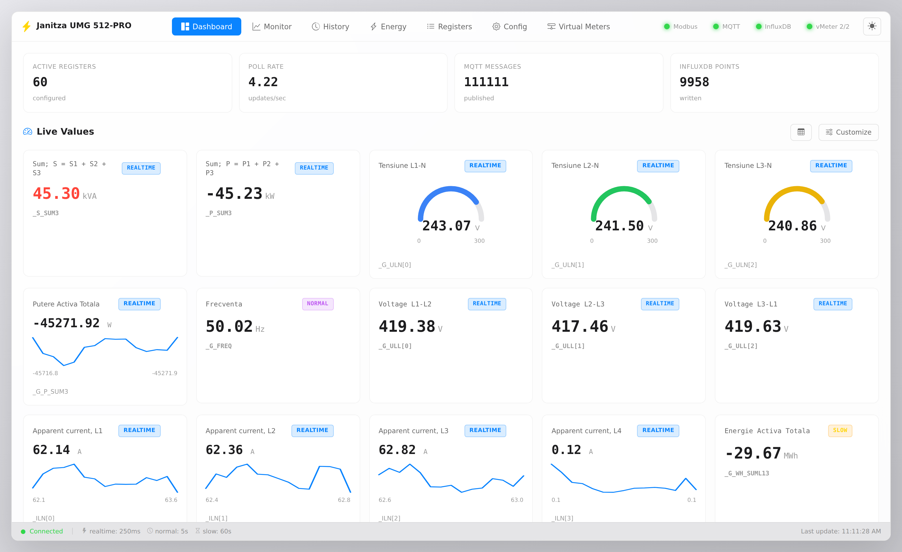

📖 **[User Manual](docs/MANUAL.md)** · 🔌 **[Virtual Meter guide](docs/VIRTUAL-METER.md)**

## Why software, not a box?

A dedicated Modbus-to-MQTT appliance is one option. This is the other: the same job in software you own and can extend — running on hardware you already have, or on a ~€50 Raspberry Pi with a USB/HAT RS-485 (and CAN) adapter, DIN-rail-mountable all the same. No vendor lock-in, no per-box cost.

- ⚡ **Configurable sub-second polling** — tunable per poll-group with no fixed floor (we run 250 ms on the realtime group); fixed-function gateways typically stop at ~5 s.
- ♾️ **No device / value caps** — bounded only by your host, not a fixed 10-device / 1000-value limit.
- 🪞 **Virtual meters** — re-serve one physical meter as many emulated devices (Victron, Fronius, SunSpec); a read-only gateway can't.
- 🔓 **Open-source, commodity hardware** — inspect it, fork it, add a protocol; run it on a Pi.

## Features

- **Modbus TCP Reader** - Direct connection to Janitza device
- **MQTT Publishing** - With Home Assistant autodiscovery support
- **InfluxDB Publishing** - Time-series storage
- **"Changed" Mode** - Publish only modified values (reduces traffic)
- **Professional Web UI** - Dashboard, Monitor, Registers, Config
- **Real-time WebSocket** - Live updates in UI
- **Hot-reload** - Configuration changes without container restart
- **Flexible Configuration** - Custom MQTT topics and InfluxDB tags per register
- **Poll Groups** - Different intervals for different data types
- **Thresholds** - Color coding for values (warning/danger)
- **Unit Scaling** - Automatic Wh→kWh, W→kW, VA→kVA conversion for readability
- **Gauge Widgets** - Configurable min/max/color with threshold-based coloring
- **🔌 Virtual Meters** - Serve one Janitza as **many virtual meters** (Carlo Gavazzi EM24 for Victron, Fronius Smart Meter for the DataManager, SunSpec…), defined as templates, with **full observability** of every Modbus request. See **[docs/VIRTUAL-METER.md](docs/VIRTUAL-METER.md)**.
- **pv-stack Integration** - Service template for Docker Services Manager

## 🔌 Virtual Meters

One UMG 512-PRO at the grid connection point measures everything. But Victron
wants a *Carlo Gavazzi EM24*, Fronius wants a *Fronius Smart Meter*, another
system wants SunSpec. Instead of buying three meters, you **define them as
templates** and serve them all from the meter you already have — each an isolated
Modbus-TCP server fed from the live values, with a **freshness watchdog** (stale
source → stop responding, so the consumer's own fail-safe engages).

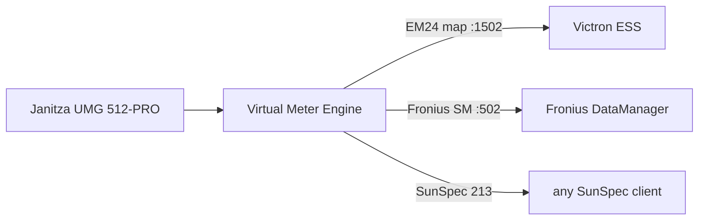
```mermaid
flowchart LR
    UMG["Janitza UMG 512-PRO"] --> ENG["Virtual Meter Engine"]
    ENG -->|"EM24 map :1502"| V["Victron ESS"]
    ENG -->|"Fronius SM :502"| F["Fronius DataManager"]
    ENG -->|"SunSpec 213"| X["any SunSpec client"]
```

**Two modes:** ① run *parallel* to the real meter to validate risk-free, then
② *consolidate* — the virtual meter replaces the physical one. Full query-log
observability the whole way.

Plus **built-in observability**: the last 1024 queries (time/FC/addr/count/
response/latency), counters, tx/rx, a requests-per-second chart — the very tool
we used to reverse-engineer the Fronius Smart Meter protocol (case study in the doc).

→ **Full guide with diagrams, examples and how to contribute: [docs/VIRTUAL-METER.md](docs/VIRTUAL-METER.md)**

## Quick Start

### With Docker (recommended)

```bash
# 1. Clone repository
git clone https://github.com/sm26449/janitza-monitor.git
cd janitza-monitor

# 2. Configure environment
cp .env.example .env
nano .env  # Edit with your values

# 3. Configure registers (optional - can be done from UI)
cp config/config.example.yaml config/config.yaml
cp config/selected_registers.example.json config/selected_registers.json

# 4. Start
docker-compose up -d

# 5. Access UI
# http://localhost:8080
```

### Run the prebuilt image (no local build)

A multi-arch image (amd64 + arm64, for Raspberry Pi too) is published to the
GitHub Container Registry on every release. Use it instead of building — in
`docker-compose.yml` replace `build: .` with:

```yaml
    image: ghcr.io/sm26449/janitza-monitor:latest
```

…or run it directly (ports: UI + the virtual-meter range + standard Modbus 502):

```bash
docker run -d --name janitza-monitor --restart unless-stopped \
  -p 8080:8080 -p 1502-1512:1502-1512 -p 502:502 \
  --env-file .env -v "$PWD/config:/app/config" \
  ghcr.io/sm26449/janitza-monitor:latest
```

> **Ports:** `8080` = Web UI · `1502-1512` = virtual meters (grow via
> `VMETER_PORT_START/END`) · `502` = standard Modbus port some consumers poll
> (drop it if it's already used on the host). Full guide: [docs/MANUAL.md](docs/MANUAL.md).

### With InfluxDB and Grafana (optional)

```bash
# Start with local InfluxDB
docker-compose --profile influxdb up -d

# Start with Grafana
docker-compose --profile grafana up -d

# Start all
docker-compose --profile influxdb --profile grafana up -d
```

## Configuration

### .env File

Copy `.env.example` to `.env` and edit:

```bash
# Modbus - Janitza Device
MODBUS_HOST=192.168.1.100
MODBUS_PORT=502
MODBUS_UNIT_ID=1

# MQTT
MQTT_ENABLED=true
MQTT_BROKER=mqtt-broker
MQTT_PORT=1883
MQTT_USERNAME=
MQTT_PASSWORD=
MQTT_PREFIX=janitza/umg512
MQTT_PUBLISH_MODE=changed    # "changed" or "all"

# InfluxDB
INFLUXDB_ENABLED=false
INFLUXDB_URL=http://influxdb:8086
INFLUXDB_TOKEN=your-token
INFLUXDB_ORG=your-org
INFLUXDB_BUCKET=janitza
INFLUXDB_PUBLISH_MODE=changed

# UI
UI_PORT=8080
```

### config/config.yaml

YAML configuration (can also be edited from UI - Settings):

```yaml
modbus:
  host: 192.168.1.100
  port: 502
  unit_id: 1
  timeout: 3
  retry_attempts: 3

mqtt:
  enabled: true
  broker: mqtt-broker
  port: 1883
  topic_prefix: "janitza/umg512"
  publish_mode: "changed"
  ha_discovery:
    enabled: true
    prefix: "homeassistant"
    device_name: "Janitza UMG 512-PRO"

influxdb:
  enabled: false
  url: "http://influxdb:8086"
  token: "your-token"
  org: "your-org"
  bucket: "janitza"
  publish_mode: "changed"

polling:
  groups:
    realtime:
      interval: 1
      description: "Real-time values"
    normal:
      interval: 5
      description: "Standard measurements"
    slow:
      interval: 60
      description: "Energy counters"
```

> **Note:** ENV variables take priority over config.yaml. You'll see a warning in UI when ENV overrides are active.

### config/selected_registers.json

Selected registers for monitoring (edit from UI - Registers):

```json
{
  "version": "1.0",
  "registers": [
    {
      "address": 19000,
      "name": "_G_ULN[0]",
      "label": "Voltage L1-N",
      "unit": "V",
      "data_type": "float",
      "poll_group": "realtime",
      "mqtt": { "enabled": true, "topic": "voltage/l1_n" },
      "influxdb": { "enabled": true, "measurement": "voltage", "tags": {"phase": "L1"} },
      "ui": { "show_on_dashboard": true, "widget": "value" },
      "thresholds": {
        "enabled": true,
        "dangerLow": 200,
        "warningLow": 210,
        "warningHigh": 245,
        "dangerHigh": 253
      }
    }
  ],
  "poll_groups": {
    "realtime": { "interval": 1 },
    "normal": { "interval": 5 },
    "slow": { "interval": 60 }
  }
}
```

## Web UI

Access `http://localhost:8080`

### Dashboard

Live view of all selected registers with widgets (value, gauge, chart), color coding based on thresholds, automatic unit scaling (Wh→kWh, W→kW), and Cards/Table view toggle.


### Monitor

Real-time graph with multiple overlapping registers. Drag & drop registers from sidebar, zoom/pan on graph, min/max/avg statistics.

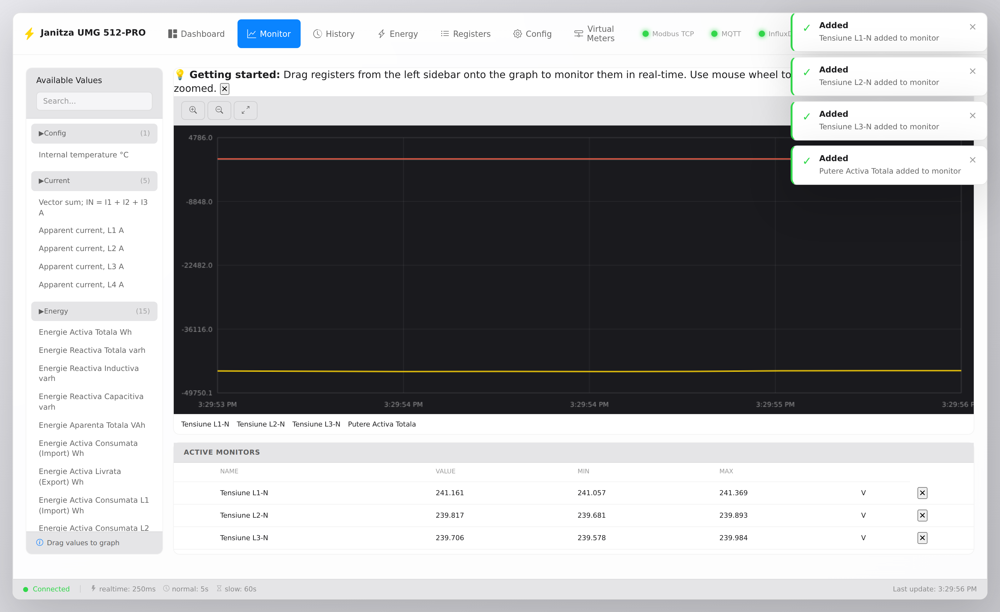

### History

Read stored measurements **back** from InfluxDB. Pick one or more registers from a searchable, category-grouped list (click to add/remove — the colored dot matches its line), choose a time range and resolution, and get mean lines on a shared Y axis with a min/max band (for a single register) and a hover crosshair whose tooltip lists every series' value at the nearest time.

Requires InfluxDB (it reads stored data back); if InfluxDB isn't enabled the view shows a clear hint instead of an empty chart.

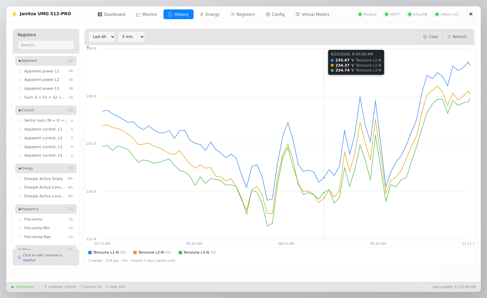

### Energy

Monthly energy accounting from InfluxDB: pick a month and see the totals —
**consumption (import)**, **injection (export)**, **reactive** and **apparent**
energy (the cumulative counters' delta over the month) — plus a daily
import-vs-export breakdown. Requires InfluxDB.

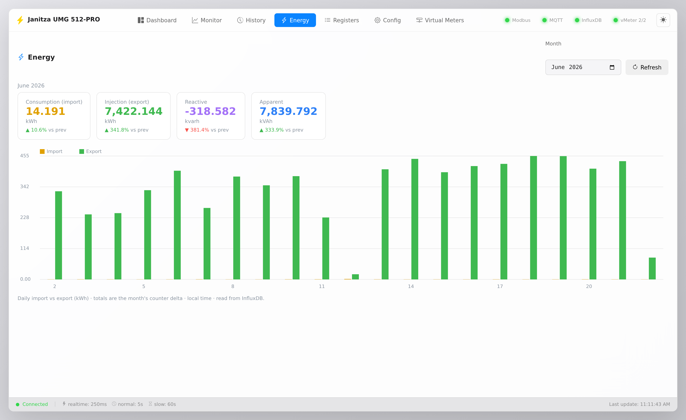

### Registers

Browser for all 4126 available registers. Search, filter by categories, quick add to monitoring with full MQTT/InfluxDB/thresholds configuration.

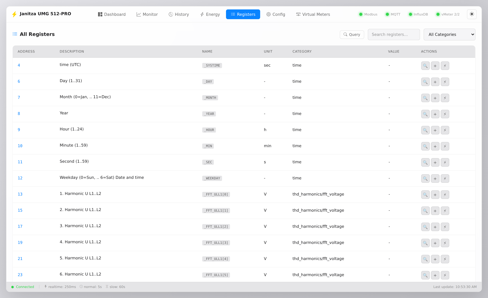

**Query on-demand** - Direct Modbus register read with value, description, category and data type display.

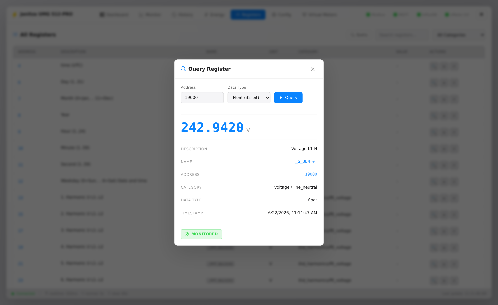

**Add Register** - Add register to monitoring with full configuration: poll group, widget, MQTT topic, InfluxDB measurement, thresholds.

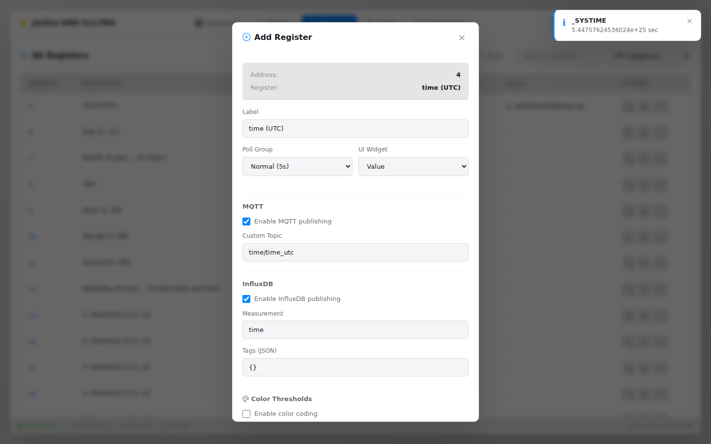

### Config - Settings

Configure Modbus, MQTT and InfluxDB directly from the interface. Hot-reload with "Apply Configuration" button for reconnection without restart. Warning for active ENV overrides.

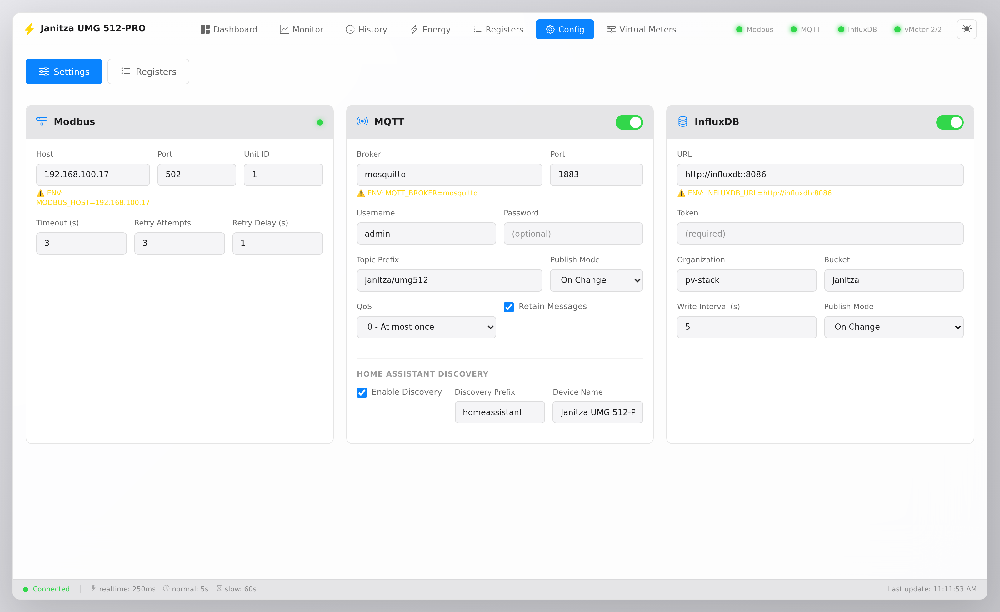

### Config - Registers

Monitored registers list with category filtering. Edit label, poll group, widget type, gauge min/max/color, MQTT topic, InfluxDB measurement and thresholds per register.

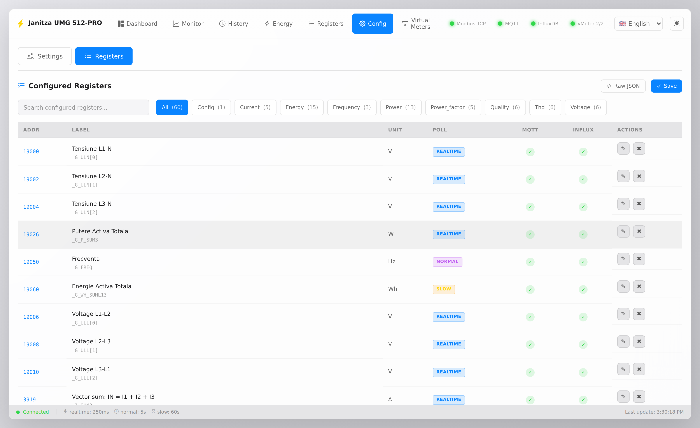

**Edit Register** - Detailed per-register configuration: widget type (value/gauge/chart), gauge options (min/max/color), MQTT topic, InfluxDB measurement/tags, color thresholds with auto-detect.

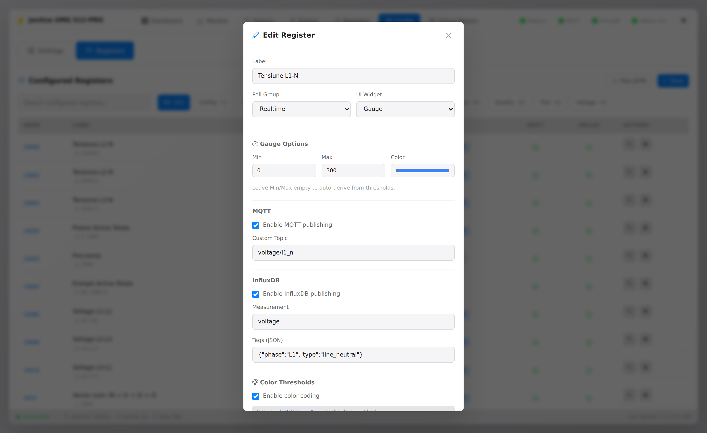

### Virtual Meters

Serve the live values as standard Modbus meters to other systems. Tabbed page: **Meters** (instances, status, live values, client connections ip:port — accordion cards), **Templates** (editor + YAML import/export), **Logs**, **Stats & Debug**. Full guide: **[docs/VIRTUAL-METER.md](docs/VIRTUAL-METER.md)**.

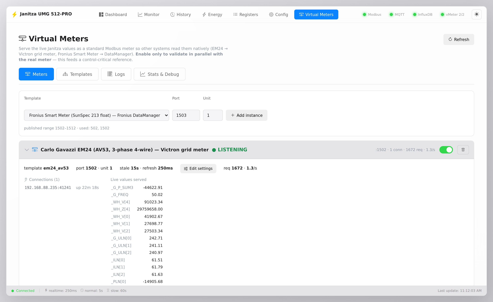

**Logs** - live log of the last 1024 Modbus requests (time, function code, address, count, OK/exception, latency, response) — exactly what the consumer reads.


**Stats & Debug** - counters (requests/errors/rate/RX/TX/uptime), a requests-per-second chart, and the most-read registers.


**Edit instance** - change an existing instance's port, unit id, freshness window (`stale_after_s`) and refresh interval right from the Meters tab; the meter restarts live to apply (it warns that a port/unit change briefly drops connected consumers).

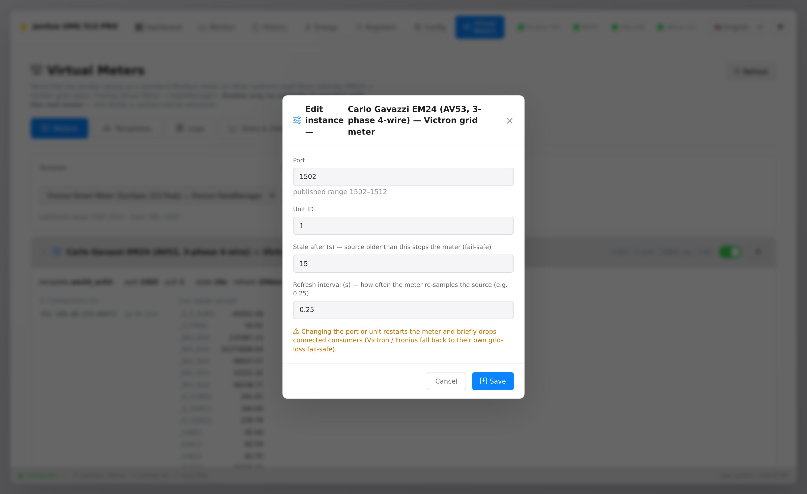

### Data-acquisition health

The Modbus status detail surfaces **data freshness**, the **last successful read**, **per-poll-group ages**, and recent **read-failure events** — so a Janitza comms loss (like an upstream Modbus dropout) is visible first-class, not just in the container logs. The same is exposed on `/health` (a `modbus` block; HTTP stays 200 on a stale source so the container never restart-loops on an unreachable device) and published to MQTT on `<prefix>/data_health` for external alerting.

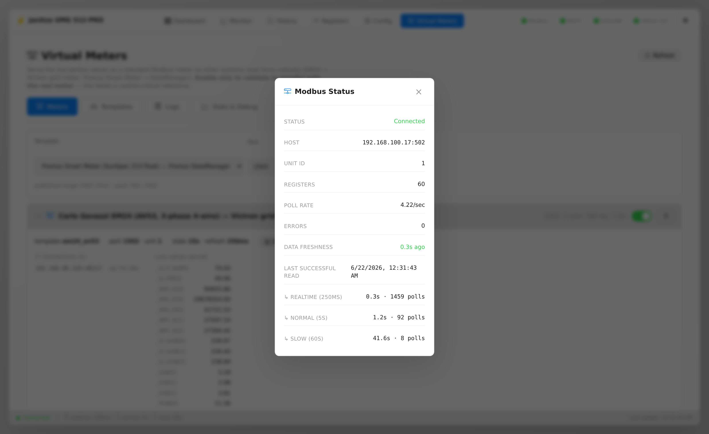

## API Endpoints

| Endpoint | Method | Description |
|----------|--------|-------------|
| `/` | GET | Web UI |
| `/api/status` | GET | System status (Modbus, MQTT, InfluxDB) |
| `/api/config` | GET | Current configuration |
| `/api/registers/all` | GET | All available registers |
| `/api/registers/selected` | GET/POST | Monitored registers |
| `/api/values` | GET | Current values |
| `/api/values/{address}` | GET | Value for specific address |
| `/api/query/register` | POST | On-demand query |
| `/api/query/batch` | POST | Batch query |
| `/api/search?q=...` | GET | Search registers |
| `/api/config/modbus` | GET/POST | Modbus config |
| `/api/config/mqtt` | GET/POST | MQTT config |
| `/api/config/influxdb` | GET/POST | InfluxDB config |
| `/api/config/apply` | POST | Apply configuration (reconnect) |
| `/api/config/reload-registers` | POST | Reload registers |
| `/ws` | WebSocket | Real-time stream |

## Home Assistant Integration

With `ha_discovery.enabled: true`, sensors are automatically created in Home Assistant.

MQTT topics:
- `janitza/umg512/voltage/l1_n` - register value
- `janitza/umg512/status` - online/offline
- `homeassistant/sensor/janitza/...` - autodiscovery configs

## Publish Mode: changed vs all

| Mode | Description | Use case |
|------|-------------|----------|
| `changed` | Publish only when value changes | Reduces traffic, ideal for MQTT |
| `all` | Publish all readings | Required for complete time-series |

In UI, the "Skipped" status shows how many messages were not published (unchanged values).

## Project Structure

```
janitza-monitor/
├── config/                    # Configuration files
│   ├── config.example.yaml
│   └── selected_registers.example.json
├── docs/                      # Modbus documentation
│   ├── modbus_data.json      # 4126 structured registers
│   └── extract_pdf.py        # PDF extraction script
├── janitza/                   # Python package
│   ├── __init__.py
│   ├── config.py             # Configuration loader
│   ├── modbus_client.py      # Modbus TCP client
│   ├── mqtt_publisher.py     # MQTT publisher
│   ├── influxdb_publisher.py # InfluxDB publisher
│   ├── register_parser.py    # Data type parser
│   └── api.py                # REST API + WebSocket
├── ui/                        # Frontend
│   ├── templates/
│   │   ├── index.html
│   │   ├── base.html
│   │   └── partials/
│   ├── css/
│   │   ├── base.css
│   │   ├── dashboard.css
│   │   ├── monitor.css
│   │   ├── registers.css
│   │   └── config.css
│   └── js/
│       └── app.js
├── main.py                    # Entry point
├── requirements.txt
├── Dockerfile
├── docker-compose.yml
├── .env.example               # Environment template
├── CHANGELOG.md
└── README.md
```

## Common Register Addresses

| Address | Name | Unit | Description |
|---------|------|------|-------------|
| 19000 | _G_ULN[0] | V | Voltage L1-N |
| 19002 | _G_ULN[1] | V | Voltage L2-N |
| 19004 | _G_ULN[2] | V | Voltage L3-N |
| 19006 | _G_ULL[0] | V | Voltage L1-L2 |
| 19008 | _G_ULL[1] | V | Voltage L2-L3 |
| 19010 | _G_ULL[2] | V | Voltage L3-L1 |
| 19012 | _G_ILN[0] | A | Current L1 |
| 19014 | _G_ILN[1] | A | Current L2 |
| 19016 | _G_ILN[2] | A | Current L3 |
| 19026 | _G_P_SUM3 | W | Total active power |
| 19034 | _G_S_SUM3 | VA | Total apparent power |
| 19042 | _G_Q_SUM3 | var | Total reactive power |
| 19050 | _G_FREQ | Hz | Frequency |
| 19052 | _G_COSPHI | - | Power factor |
| 19060 | _G_WH_SUML13 | Wh | Total active energy |

See `docs/modbus_data.json` for the complete list of 4126 registers.

## pv-stack Integration (Docker Services Manager)

For deployment in pv-stack with shared mosquitto and influxdb:

```bash
# Copy files to templates
cp -r janitza-monitor/* docker-setup/templates/janitza-monitor/

# Deploy via docker-compose
docker compose -f docker-compose.pv-stack.yml build janitza-monitor
docker compose -f docker-compose.pv-stack.yml up -d janitza-monitor
```

Variables are configured in `.env` with `JANITZA_` prefix:

```bash
JANITZA_MODBUS_HOST=192.168.1.100
JANITZA_MQTT_BROKER=mosquitto
JANITZA_INFLUXDB_ENABLED=true
JANITZA_INFLUXDB_URL=http://influxdb:8086
JANITZA_INFLUXDB_BUCKET=janitza
JANITZA_UI_PORT=8080
```

See `service.yaml` for the complete list of variables and dependencies.

## Development

```bash
# Clone
git clone https://github.com/sm26449/janitza-monitor.git
cd janitza-monitor

# Virtual environment
python3 -m venv venv
source venv/bin/activate

# Install dependencies
pip install -r requirements.txt

# Run locally
python main.py --debug

# Rebuild Docker
docker-compose up --build -d

# View logs
docker-compose logs -f
```

## Troubleshooting

### Modbus won't connect
- Check the Janitza device IP address
- Ensure port 502 is accessible
- Verify Unit ID (default: 1)

### MQTT not publishing
- Check if broker is accessible
- Verify username/password
- Check logs: `docker-compose logs -f | grep MQTT`

### InfluxDB skipped messages
- Normal for `publish_mode: changed` - unchanged values are not written
- Switch to `publish_mode: all` if you need all data

### ENV override warning in UI
- ENV variables take priority over config.yaml
- Remove the variable from .env if you want to use the UI value

## Security

The Web UI and REST API are **unauthenticated** — including control endpoints
(virtual-meter enable/disable, config edits). A virtual meter can feed a control
loop (ESS / export limiting), so treat this as a trusted-LAN appliance:

- Run it on a **private/management LAN**, not exposed to the internet.
- If you must reach it remotely, put it **behind a reverse proxy with auth** (or
  a VPN). Do not port-forward 8080 / the meter ports.
- Virtual meters bind `0.0.0.0` by default — restrict at the network layer.

**Optional write key.** Set `API_KEY` (env) to require an `X-API-Key` header on every
state-changing request (POST/PUT/PATCH/DELETE); read-only telemetry (GET) and the
on-demand register queries stay open. The Web UI prompts for the key once and
remembers it. Leave it empty (default) for a fully open, trusted-LAN appliance. This
is defense-in-depth — not a substitute for keeping 8080 off untrusted networks.

## Contributing

Found a bug or have a feature request? Please open an issue on [GitHub Issues](https://github.com/sm26449/janitza-monitor/issues).

## Authors

**Stefan M** - [sm26449@diysolar.ro](mailto:sm26449@diysolar.ro)

**Claude** (Anthropic) - Pair programming partner

## License

**PolyForm Noncommercial License 1.0.0** — free for personal and other
**noncommercial** use; commercial use requires a separate license.

Copyright (c) 2024-2026 Stefan M <sm26449@diysolar.ro>

You may use, copy, modify, and share this software **for any noncommercial
purpose** — personal, hobby, research, education, or non-profit. **Commercial
use is not permitted** under this license; contact the author for a commercial
license. Full terms in [LICENSE](LICENSE) ·
<https://polyformproject.org/licenses/noncommercial/1.0.0/>

---

**Disclaimer**: This software is provided "as is", without warranty of any kind. Use at your own risk when monitoring critical energy systems.
