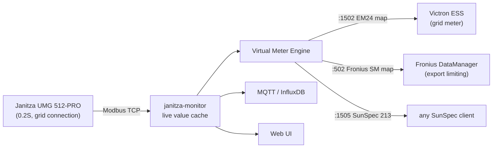
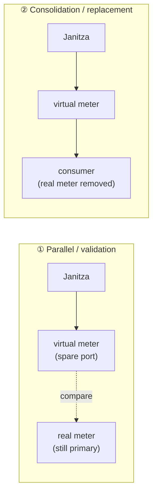
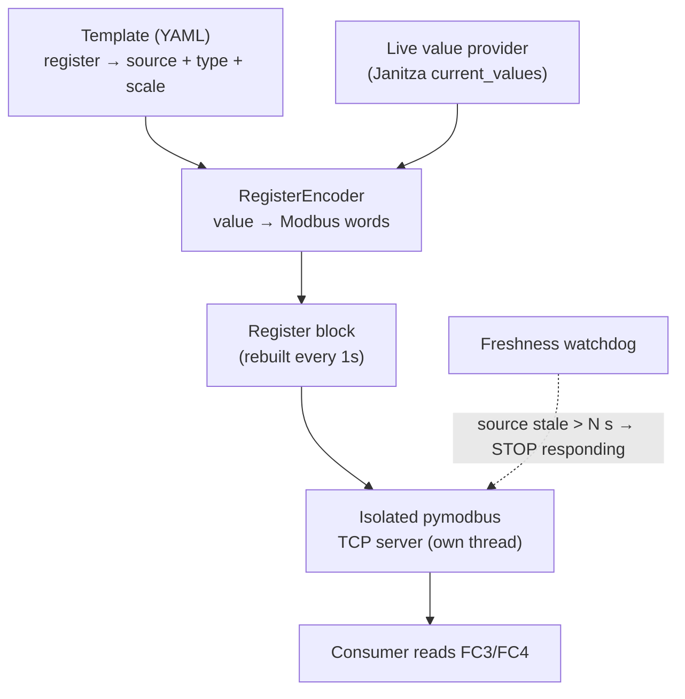
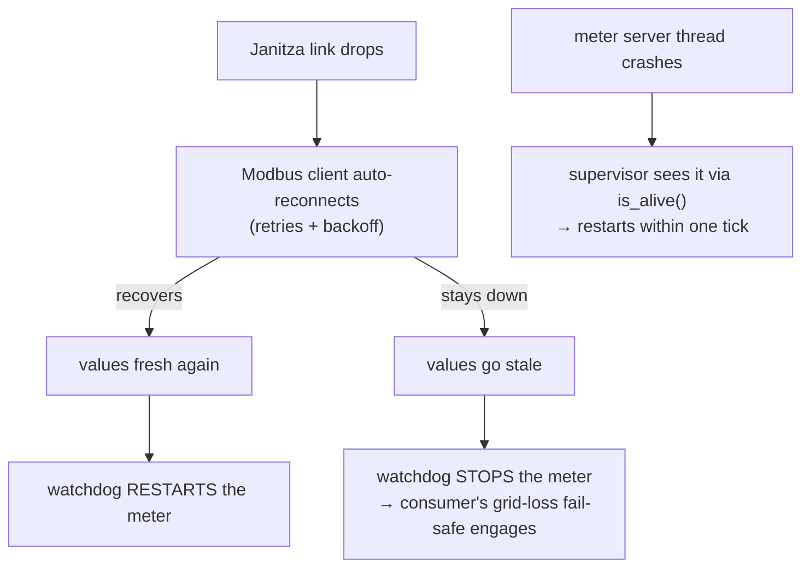
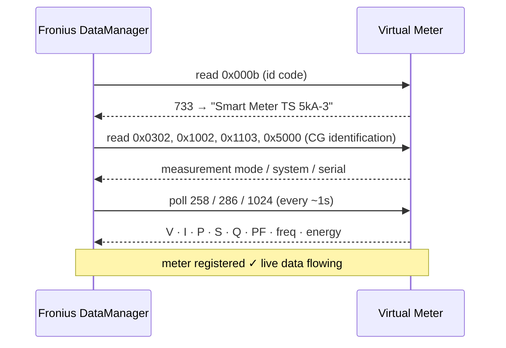

# Virtual Meter Engine

🇬🇧 **English** | [🇷🇴 Română](VIRTUAL-METER.ro.md)

> Turn **one** physical power-quality analyzer into **many** virtual meters —
> each one speaking the exact Modbus dialect a consumer expects — with full,
> built-in observability of every request.

One Janitza UMG 512-PRO sits at your grid connection point. It already measures
everything: per-phase voltage, current, power, power factor, frequency, energy.
Meanwhile your Victron ESS wants a *Carlo Gavazzi EM24*, your Fronius inverter
wants a *Fronius Smart Meter*, and a third system wants plain SunSpec. Normally
you'd buy three meters. **Here you define them as templates and serve them all
from the one meter you already have.**



Each virtual meter is an **isolated Modbus-TCP server** fed from the live Janitza
values, so a UI/MQTT hiccup never interrupts metering. A meter is just a **YAML
template** (a register map + source bindings) — adding a new one needs no code.

---

## Two ways to run it



**① Parallel (validation)** — run the virtual meter on a spare port *next to* the
real meter, point a test consumer (or just the **Logs** tab) at it, and compare.
Nothing control-critical depends on it yet. This is how you build confidence and
reverse-engineer a new consumer — risk-free.

**② Consolidation (replacement)** — once validated, the virtual meter becomes the
consumer's meter and the dedicated physical meter is removed. **One Janitza now
serves every consumer** (Victron grid meter + Fronius export limiting + …). This
is the end state: fewer boxes, one source of truth, the freshness watchdog as the
safety net.

> Always go ①→② on a meter that feeds a control loop. Never wire a brand-new
> virtual meter straight into ESS/export limiting without the parallel check.

---

## How it works



1. **Template** declares each register: address, type (`int16`/`uint32`/`float`/
   `string`…), scale, byte order, and where its value comes from — a **live**
   Janitza register, a **constant**, or a **sum** of several live registers.
2. The **engine** resolves the template against the live cache and encodes every
   value into Modbus words, rebuilding the register block once per second.
3. Each enabled instance runs its **own pymodbus TCP server in its own thread**.
4. A **freshness watchdog** is the safety core: if the Janitza source goes stale
   (> `stale_after_s`), the server **stops responding** so the consumer's own
   grid-meter-loss fail-safe engages — we never feed silently-stale data into a
   control loop. Multi-register values are written atomically (no word-tearing).

---

## Reliability & uptime

A virtual meter can sit in a control loop (Victron ESS, Fronius export limiting),
so the engine is built to **self-heal and fail safe** — never to feed bad data.



Four independent guards, each running on its own:

1. **Source reconnect** — the Janitza Modbus client reconnects automatically on
   a dropped socket (retry attempts + delay), so a transient network blip
   doesn't take the data offline.
2. **Freshness watchdog** — if values go stale beyond `stale_after_s`, the meter
   **stops responding** rather than serving a frozen value. The consumer then
   engages its own grid-meter-loss fail-safe. Stale-but-served is the one thing
   we never do.
3. **Crash recovery** — each meter runs an isolated daemon thread with its own
   asyncio loop; a supervisor checks the actual thread health (`is_alive()`, not
   just a flag) every tick and restarts a dead server, with backoff if a port is
   briefly held. The supervisor body is fully guarded so it can never die.
4. **Consumer reconnect** — when a meter comes back, the consumer reconnects to
   the TCP server normally; pymodbus accepts the new connection.

**No data loss:** the live cache always holds the latest reading; the engine
serves the freshest value or fails safe — it never serves stale. (The monitor's
backfill can also self-heal InfluxDB gaps from the meter's onboard recording.)

**Cost of observability:** one in-RAM `deque` append per read (latency measured
in single-digit microseconds) — it never touches the serving path's correctness
because every stats call is exception-guarded.

---

## Observability — see exactly what your consumer reads

Every read a consumer issues is recorded in RAM (no setup, no persistence):
the **last 1024 queries** with address, count, response sample, latency and
error flag, plus live counters and a per-second request-rate chart.

This is not a side feature — **it is the tool that let us reverse-engineer the
Fronius Smart Meter protocol** (see the case study below), now built into the UI.

| Tab | What you get |
|-----|--------------|
| **Meters** | every instance: status, served live values, port/unit, enable toggle |
| **Templates** | list · editor · **Import / Export YAML** |
| **Logs** | live table of the last queries — `time · FC · addr · count · OK/EXC · latency · response` |
| **Stats & Debug** | total / errors / req-rate / RX / TX / uptime · **requests-per-second chart** · most-read registers |

A real query-log line looks like:

```
20:44:57.102   FC3   addr 0    count 80   OK    6µs   2343 0 2334 0 2337 0 …
20:44:57.113   FC3   addr 41216 count 1   OK    6µs   3
```

**Meters** — every instance with its live served values:


**Logs** — every read the consumer issues, live (this is how the Fronius map was found):


**Stats & Debug** — counters, requests-per-second chart, and the registers the consumer reads most:


### API

| Endpoint | Purpose |
|----------|---------|
| `GET /api/virtual-meters` | instances + live status + served values |
| `GET /api/virtual-meters/{id}/stats?limit=N` | query log + counters + rate + per-register |
| `GET /api/virtual-meters/template/{id}/export` | template YAML (download) |
| `POST /api/virtual-meters/templates/import` | import a template YAML (validated before save) |
| `PUT /api/virtual-meters/template/{id}` | create / edit a template |
| `POST /api/virtual-meters/{id}/toggle?on=true` | enable / disable an instance |

### Monitoring via MQTT (e.g. alertd)

Every ~10 s each meter's health is published **retained** to
`<MQTT_PREFIX>/vmeter/<id>/state` (e.g. `janitza/umg512/vmeter/fronius_ts_native/state`):

```json
{ "id": "fronius_ts_native", "name": "Fronius Smart Meter TS 5kA-3 (native CG)",
  "port": 502, "unit_id": 1, "enabled": true, "running": true,
  "state": "listening", "connections": 1, "requests": 84213, "errors": 0,
  "last_fresh": "2026-06-18T22:29:17", "ts": 1781821757 }
```

`state` is `listening` / `stale` / `disabled`. Point any monitor at it — e.g. an
**alertd** variable on that topic with `json_path: state`, and rules like:

- `state != "listening"` while enabled → the meter stopped serving (source stale
  or crashed) — page the operator.
- `var_age() > 60` → the publisher itself is down (monitor crashed) — the `ts`
  field / retained message age makes this trivial to detect.
- `errors` rising → the consumer is hitting illegal-address reads (map mismatch).

---

## Templates

A template is a register map. Anatomy:

```yaml
template:
  id: em24_av53                       # filename-safe id
  name: "Carlo Gavazzi EM24 — Victron grid meter"
  byte_order: little                  # EM24 is low-word-first (Reg_s32l)
  transport: { type: tcp, port: 1502, unit_id: 1, bind: "0.0.0.0" }
  registers:
    - { addr: 0x000b, type: uint16, source: { const: 1651 } }            # model id
    - { addr: 0x0028, type: int32, scale: 10, source: { live: "_G_P_SUM3" } }   # total power
    - { addr: 0x0000, type: int32, scale: 10, source: { live: "_G_ULN[0]" } }   # V L1
```

Source kinds: `{ live: "_NAME" }` (a Janitza register), `{ const: N }`,
`{ const_str: "TEXT" }`, `{ sum: ["_A","_B","_C"] }` (sum of live registers).

Shipped templates:

| Template | Emulates | Consumer | Notes |
|----------|----------|----------|-------|
| `em24_av53` | Carlo Gavazzi EM24 (AV53, 3-phase) | Victron Venus ESS | proven in production |
| `fronius_ts_native` | Fronius Smart Meter TS 5kA-3 (native CG map) | Fronius Symo DataManager | see case study |
| `fronius_sunspec_meter` | Generic SunSpec model 213 (3-phase, float) | any SunSpec-TCP client | clean SunSpec example |

Define your own in the **Templates** tab, or import a `.yaml` someone shared.

---

## Case study — emulating a Fronius Smart Meter

The Victron path (EM24) is well documented. The Fronius path was not — and the
journey is the best illustration of what this tool is for.

A Fronius **Smart Meter TS** is a rebadged **Carlo Gavazzi** meter. A Symo
DataManager does **not** read it over SunSpec — it uses **proprietary CG/Fronius
registers** for identification and the **native `258` / `286` / `1024` blocks**
for data. We found this by serving a candidate map, then **watching the Logs tab**
to see exactly which registers the DataManager requested and in what order:



What the query log made obvious (and what tripped us up first):

- The DM **probes proprietary registers** (`0x000b`=733, `0x0300`, `0x06aa`) and
  expects **values, not zeros and not Modbus exceptions** — a generic SunSpec
  meter that excepts there is rejected.
- The **data lives in the native CG blocks** `258`/`286`/`1024`, **not** SunSpec
  `40071`. Reactive energy is split `kVArh`/`VArh` across the block.
- The DM polls live data ~**1×/second** and energy ~**1×/10 s** — visible
  directly in the Stats chart.

The result: a Janitza-fed virtual meter that a real Fronius DataManager accepts
as a `Smart Meter TS 5kA-3` with complete, live, correct data. Full register
mapping is documented inline in [`config/templates/fronius_ts_native.yaml`](../config/templates/fronius_ts_native.yaml).

---

## Quick start

```bash
# 1. publish a port range for the meters (docker-compose), e.g. 1502-1512 (+ 502)
# 2. drop a template in config/templates/   (or use the UI editor)
# 3. add an instance:
curl -X POST localhost:8080/api/virtual-meters \
     -H 'Content-Type: application/json' \
     -d '{"template":"em24_av53","port":1502,"unit_id":1,"enabled":false}'
# 4. validate IN PARALLEL with the real meter, then enable + point the consumer here
```

> ⚠️ **A virtual meter can feed a control loop** (ESS, export limiting). Always
> validate in parallel against the real meter first, confirm the consumer's
> grid-loss fail-safe, and only then cut over. The freshness watchdog is your
> safety net, not a substitute for validation.

---

## Contributing — add a meter, grow the project

The whole point of templates is that **a new meter is data, not code**. If you
have a consumer that wants a meter we don't ship yet:

1. Add a template in `config/templates/<your_meter>.yaml`.
2. Enable it on a spare port, point the consumer at it.
3. Open the **Logs** tab and watch what the consumer reads — adjust the map until
   it's happy. (This is exactly how `fronius_ts_native` was built.)
4. Export the template and open a PR with it + a note on the consumer + firmware.

Ideas we'd love help with: more Carlo Gavazzi / SunSpec / Schneider / Eastron
maps, a per-register "diff vs real meter" view, optional persistence of the query
log, and packaging the engine as a standalone service.

Issues and PRs welcome — the engine is small, isolated, and well-commented.
